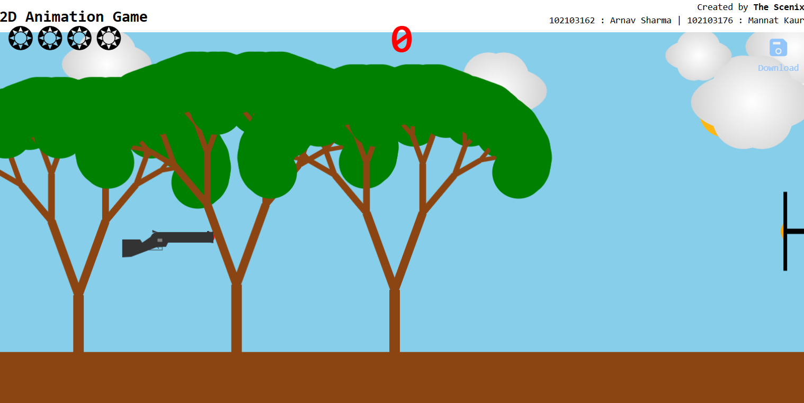

# Bullseye Blitz

## Overview
**Created by:** The Scenix (102103162: Arnav Sharma | 102103176: Mannat Kaur)

The aim of this project is to create an interactive animation 
that simulates shooting at a target and rewards hitting the 
bullseye with a display of fireworks. 

The drawing assets have been created using Inkscape,
wherein the static and dynamic parts have been
segregated by layers.  Thus the export was separately
possible and controlled.

## Project GIF

## The Storyboard

Static and Dynamic Parts:

**Static Parts:** 
The static parts of the animation include:
1. The gun
2. The trees
3. The sun.

**Dynamic Parts:** 
The dynamic parts of the animation include:
1. Firing the bullet
2. Moving target board
3. Movement of clouds 
4. The fireworks

**Rationale:**
1. Engagement: The static elements set the stage for the 
interaction, while the dynamic parts create engagement 
by allowing the user to participate actively in the animation.
2. Feedback Loop: The dynamic nature provides immediate feedback
to the user's actions, enhancing the interactive experience.
3. Reward System: The fireworks and extra bullets serve as a 
reward for hitting the bullseye, encouraging users to aim 
accurately and providing a satisfying conclusion to the interaction.

**Story and Problem Solving:**

The story revolves around the user's role as a shooter aiming 
at the bullseye. The problem addressed is how to create a compelling 
and interactive animation that accurately simulates shooting mechanics 
and rewards precise aim. 
Challenges faced include:
1. Event Handling: Managing user input for firing the bullet and 
detecting hits on the bullseye involved complex event handling logic.
2. Visual Effects: Designing visually appealing fireworks that synchronize
with the hit event without causing performance issues posed technical 
and artistic challenges.

## Demo ##

Link to [Working Demo](./demo)

## Roles ##

**Arnav Sharma** : 

**Mannat Kaur**: 
