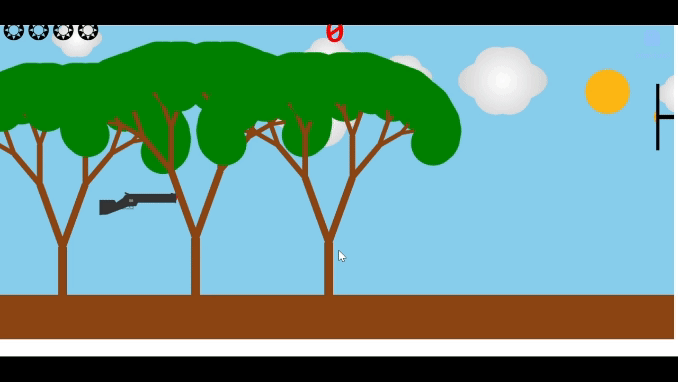

# Bullseye Blitz

## Overview
**Created by:** The Scenix (102103162: Arnav Sharma | 102103176: Mannat Kaur)

The aim of this project is to create an interactive animation 
that simulates shooting at a target and rewards hitting the 
bullseye with a display of fireworks. 

## The Storyboard

## Project GIF

## Project in Detail

**Static Parts:** 
The static parts of the animation include:
- The gun
- The trees
- The sun.

**Dynamic Parts:** 
The dynamic parts of the animation include:
- Firing the bullet
- Moving target board
- Movement of clouds 
- The fireworks

**Rationale:**
- Engagement: The static elements set the stage for the 
interaction, while the dynamic parts create engagement 
by allowing the user to participate actively in the animation.
- Feedback Loop: The dynamic nature provides immediate feedback
to the user's actions, enhancing the interactive experience.
- Reward System: The fireworks and extra bullets serve as a 
reward for hitting the bullseye, encouraging users to aim 
accurately and providing a satisfying conclusion to the interaction.

**Story and Problem Solving:**

The story revolves around the user's role as a shooter aiming 
at the target board. The problem addressed is how to create a compelling 
and interactive animation that accurately simulates shooting mechanics 
and rewards precise aim. 

**Challenges**
- Event Handling: Managing user input for firing the bullet and 
detecting hits on the bullseye involved complex event handling logic.
- Visual Effects: Designing visually appealing fireworks that 
synchronize with the hit event, movement of board, bullets and the clouds
without causing performance issues posed technical and artistic challenges.

**How we solved these challenges**
- Event Handling: We solved this challenge by comaparing the positions of 
the board as well as the bullet. When the bullet has coordinates that lie 
within the range of the boards, points are awarded. The points are awarded 
based on the distance of the bullet, the moment it hits the board, from the 
bullseye. Here is a link to the code snippet, where we solved this challenge
[collision logic](https://github.com/arnavroh45/Bullseye_Blitz/blob/arnav/demo/script.js#L317-L322).

- Visual Effects: We created a circle with a large radius with balls on 
its borders and positioned it at such a position, that it looks like a firework.
Here is the code snippet for the
[creation of fireworks](https://github.com/arnavroh45/Bullseye_Blitz/blob/arnav/demo/script.js#L154-L172) and 
[their synchronization](https://github.com/arnavroh45/Bullseye_Blitz/blob/arnav/demo/script.js#L320-L321).

## Demo ##

Link to [Working Demo](./demo).

## Resources Referred ##

- [For representing the number of bullets remaining on the top left hand corner.](https://www.w3schools.com/charsets/tryit.asp?deci=10050)
- [For referring to canvas rendering context concepts.](https://developer.mozilla.org/en-US/docs/Web/API/CanvasRenderingContext2D)
- [For DOM manipulation](https://code.jquery.com/jquery-3.5.1.js)
- [For the entry page backdrop](https://pngtree.com/freebackground/shooting-training-flat-composition-with-two-male-characters-in-protective-ammunition-holding-weapon-and-shooting-at-targets-vector-illustration_1872162.html)

## Roles ##

**Arnav Sharma** 
- Created Documentation Website
- Drew and animated elements(Bullet, Board) 
- Added Funcitonalities(Scores)
- Collision Detection Logic

**Mannat Kaur**: 
- Storyboard Design
- Home Page Design
- Drew and animated elements(Gun, Clouds, Fireworks and Trees) 
- Added Functionalities(Remaining Bullets)
- Added the timeout for each shot
